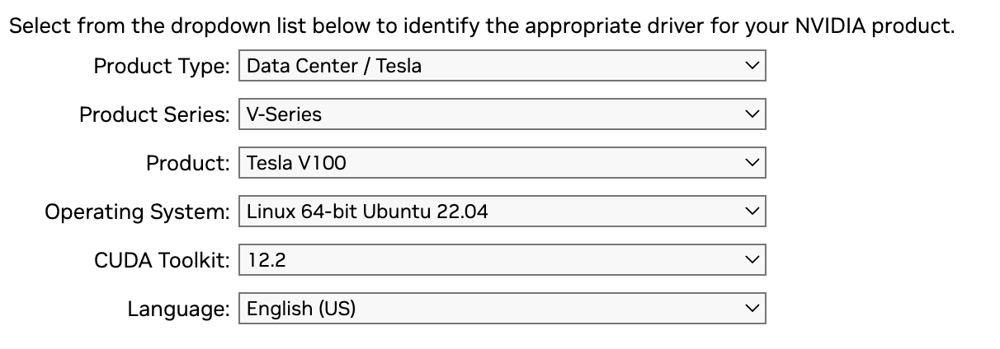

# Setting up Ray Cluster

1. Install `lambda-stack` to get gpu running with same version across all the local machines.
2. Install `ray` using `pip install ray` on all the local machines with same versions.
3. Remove firewall rules for `ray` to work properly.
4. Generate ssh keys using `ssh-keygen` and copy the public key to all the local machines using `ssh-copy-id` command. passwordless ssh is good for `ray` to work properly with out config-file.
5. Run the ray-cluster.yaml config file using `ray up` command.

<div style="background-color: #fcf8e3; color: #8a6d3b; padding: 15px; border: 1px solid #faebcc;">
  <strong>Important : </strong> Lambda Stack don't support Power PC's so we might need to install the nvidia-graphics driver and nvidia-docker runtime manually.
</div>

###### Steps
1. Download the nvidia-gpu-driver
<a href="https://www.nvidia.com/download/index.aspx?lang=en-us"> nvidia-driver </a> with the following options.
    

2. Install the nvidia-gpu-driver

```bash
sudo chmod +x <nvidia-driver>.run
sudo ./<nvidia-driver>.run
```
3. Install the nvidia-docker container toolkit.
